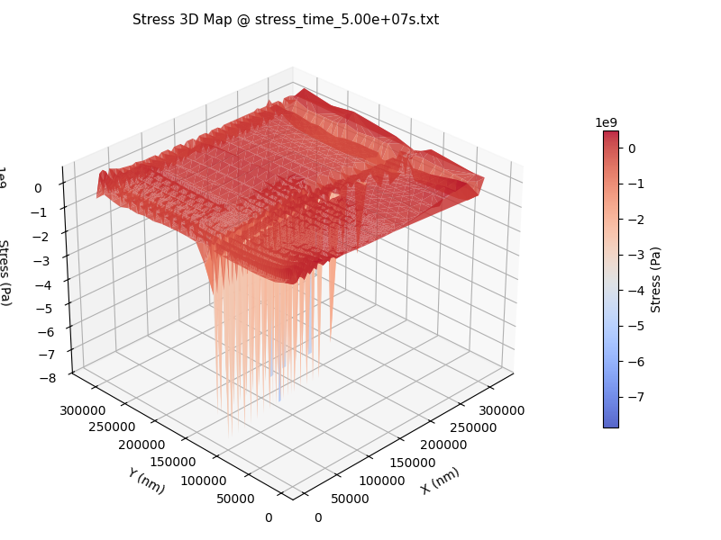
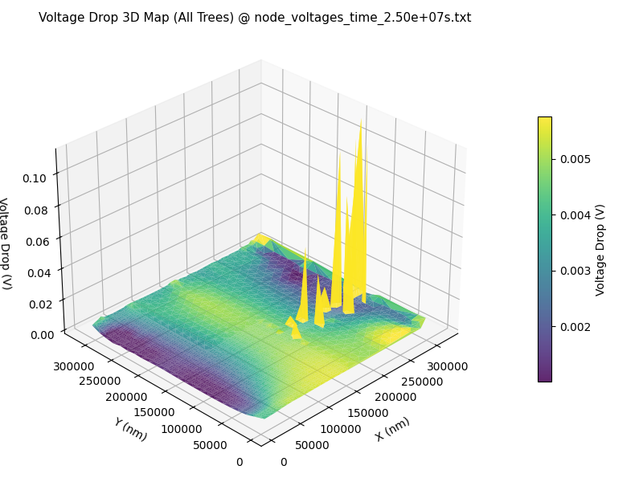
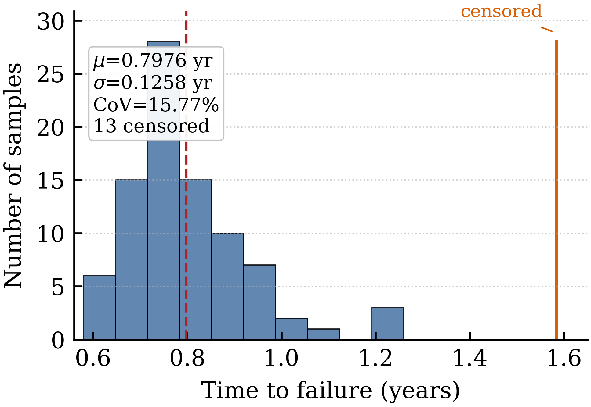

# EMSpice 3

**A full-chip temperature-aware multiphysics framework for electromigration (EM), thermomigration (TM), and IR-drop analysis.**

EMSpice 3 performs coupled EM, TM, and IR-drop analysis of practical power-grid (P/G)
networks under realistic spatial thermal fields. To our knowledge, it is the first
EM-IR analysis flow that jointly incorporates Joule heating, practical chip-level thermal
maps, iterative resistance feedback, and Monte Carlo lifetime prediction for full-chip P/G
designs — and it integrates with both the open-source OpenROAD framework and the
industry-standard Synopsys ICC and Fusion Compiler environments for practical EM/IR sign-off.

> 🌐 **Marketing site:** open [`index.html`](index.html) in a browser (or host it with GitHub Pages).

<p align="center">
  
  
  
</p>
<p align="center"><sub>RISC-V core: coupled EM/TM stress map (18 nucleation sites) · 3D IR-drop map · Monte Carlo TTF distribution (15.77% CoV).</sub></p>

---

## Highlights

- **Coupled EM / TM / IR-drop multiphysics** — a finite-difference (FDTD) transient solver
  for the discretized Korhonen stress equation, coupled to an MNA IR-drop solver, with a
  closed electrical–thermal–reliability feedback loop.
- **Realistic spatial thermal maps** — accepts external chip-level temperature maps
  (including real measured profiles) rather than assuming a uniform die temperature.
- **Joule self-heating** — resolves per-node / per-segment wire temperature from current
  density and path resistance.
- **Iterative resistance feedback** — void-driven resistance changes are written back to the
  netlist so every IR-drop solve reflects the current aging state of the grid.
- **Monte Carlo statistical lifetime** — re-runs the full pipeline across sampled material
  parameters to produce time-to-failure (TTF) *distributions*, not just a single estimate.
- **OpenROAD + Synopsys integration** — operates on power-grid netlists from both the
  open-source OpenROAD framework and Synopsys ICC / Fusion Compiler; retains via resistances
  for accurate early-failure assessment.
- **Fully agentic-flow aware** — a scriptable CLI and structured data interface let EMSpice 3
  plug into any agentic EDA flow for automated, closed-loop IR-drop and EM sign-off analysis,
  with all inputs and outputs exposed for programmatic control by AI agents and orchestration
  scripts.
- **Rational Krylov acceleration** — **1.18×–1.50× speedup with zero reported TTF / final-IR
  metric error** relative to the default non-Krylov FDTD analysis across six benchmark designs.

---

## Key technical contributions

| Technique | What it does |
|---|---|
| **Extended rational Krylov subspace** | Projects each *n*-node stress system onto an order-*q* subspace (`q ≪ n`). A shifted resolvent regularizes the Neumann singularity for stable convergence; dispatched only when `n ≥ max(3q, 30)`. |
| **Robin-BC mid-tree nucleation** | Enforces the zero-flux void condition at interior junction nodes via a Robin stencil — no dynamic tree splitting or matrix re-meshing at runtime. |
| **Via-aware early-failure detection** | Retains via resistances through netlist conversion and checks the early-failure (open-circuit) condition *continuously* during void growth, instead of assuming immediate failure at nucleation. |
| **Implementation optimizations** | LRU basis caching, loop-free vectorized time stepping on uniform grids, and a single BLAS `dgemm` batch lift back to full space. |

---

## Analysis flow

```
 Inputs ──────────────────────────────────────────────┐
   • Power-grid netlist                                │
   • YAML material / solver parameters                 │
   • Optional spatial thermal map                      │
                                                       ▼
   Parse  ─►  Steady-state immortality screening (optional)
                                                       │
              ┌────────────────── Transient aging loop ──────────────────┐
              │  IR-drop solve (MNA): nodal V, branch current density     │
              │  Thermal field loaded & cached                           │
              │  Per-tree FDTD stress solve  ──► void nucleation & growth │
              │      • large trees → rational Krylov                      │
              │      • small trees → backward Euler                       │
              │  Via-aware resistance update (early / late failure)       │
              │  Write back to netlist ──────────────────────────────────┘
                                                       ▼
   Outputs: stress maps, void state, IR-drop maps, updated netlist, TTF
```

---

## Results at a glance

### Cross-design benchmarks

Power-grid networks extracted from Synopsys Fusion Compiler, synthesized and placed-and-routed
with the SAED32 (Synopsys 32/28 nm Generic) library. `TTF > 5.0×10⁷ s` means the 10% IR-drop
failure threshold was not reached within the simulated horizon.

| Design | Trees | Max nodes/tree | Init IR % | Final IR % | TTF (s) | Mortal | Baseline (s) | Krylov (s) | Speedup | Err % |
|---|---:|---:|---:|---:|---:|---:|---:|---:|---:|---:|
| AES_new       | 97  | 3,450  | 6.14 | 6.86  | >5.0×10⁷ | 688   | 4.56  | 3.76  | 1.21× | 0 |
| armcore_pad   | 68  | 1,700  | 0.29 | 0.29  | >5.0×10⁷ | 0     | 2.35  | 1.99  | 1.18× | 0 |
| JPEG_new      | 178 | 6,300  | 6.56 | 6.77  | >5.0×10⁷ | 1,821 | 16.31 | 12.90 | 1.26× | 0 |
| armcore_logic | 208 | 10,900 | 8.85 | 22.21 | 1.05×10⁷ | 206   | 40.60 | 31.48 | 1.29× | 0 |
| dual_ram      | 55  | 1,450  | 0.09 | 0.10  | >5.0×10⁷ | 179   | 2.32  | 1.55  | 1.50× | 0 |
| risc_core     | 186 | 5,750  | 6.19 | 29.64 | 2.47×10⁷ | 18    | 5.40  | 4.45  | 1.21× | 0 |

### Spatial thermal structure dominates average temperature

For the **RISC-V core**, two thermal maps with the same 353 K average and nearly identical
maximum temperature (387.1 K vs 387.6 K) give opposite outcomes: the baseline map fails at
~9.4 months, while the broad Qualcomm-measured map never crosses the 10% IR-drop threshold —
because its hotspot does not align with the critical current paths. This produces a
**non-monotonic** relationship between average temperature and TTF.

### Design-dependent variation sensitivity (Monte Carlo)

100 samples per design with 20% coefficient of variation on EM diffusivity κ(x) and critical
stress, under the 353 K Joule-heating thermal condition:

| Design | Mortal trees | TTF coefficient of variation |
|---|---:|---:|
| RISC-V core      | 18  | **15.77%** |
| ARM Cortex-A core | 206 | **0.0058%** |

Designs with a few *marginally* mortal trees benefit most from statistical analysis; deeply
mortal designs behave nearly deterministically.

---

## Inputs

| Input | Description |
|---|---|
| **Power-grid netlist** | Extracted P/G network (e.g. from Synopsys ICC / Fusion Compiler), with via resistances retained for early-failure analysis. |
| **YAML parameters** | Material properties, electrical properties, and numerical/solver settings (simulation horizon, time steps, Krylov order/shift, thresholds, etc.). |
| **Thermal map** *(optional)* | External spatial temperature distribution for TM-aware analysis; if omitted, Joule heating alone is applied over the ambient baseline. |

## Outputs

- Hydrostatic stress maps and void nucleation sites over the power grid
- Per-node Joule-heating / temperature distributions
- IR-drop maps over the aging trajectory
- Updated (degraded) netlists per outer timestep
- Deterministic TTF and Monte Carlo TTF distributions (with censored-sample accounting)

---

## Citation

If you use EMSpice 3 in your research, please cite:

```bibtex
@article{lu2026emspice3,
  title   = {A Full-Chip Temperature-Aware Multiphysics Framework for
             Electromigration, Thermomigration, and IR-Drop Analysis},
  author  = {Lu, Haotian and Tan, Sheldon X.-D.},
  year    = {2026},
  note    = {University of California, Riverside}
}
```

---

## Acknowledgments

Developed by the **VLSI System Computing CAD Lab (VSCLAB)**, Department of Electrical and Computer
Engineering, University of California, Riverside. 
